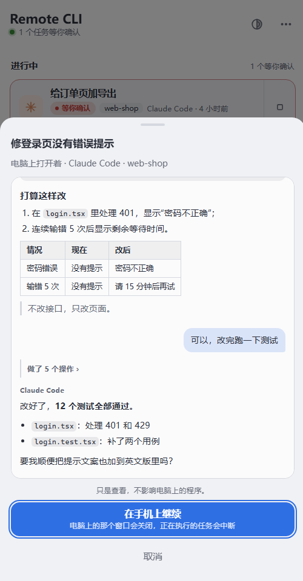
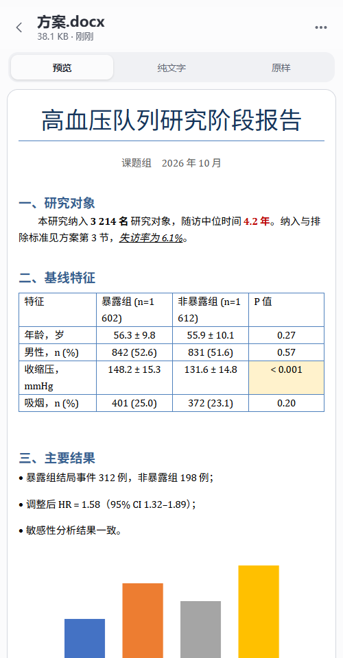
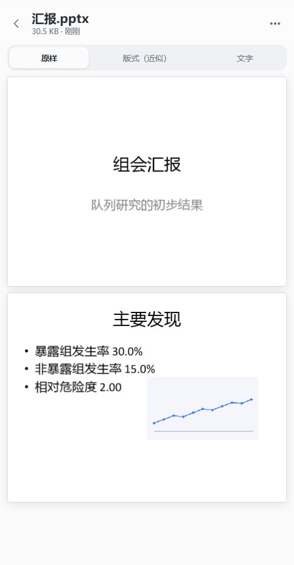
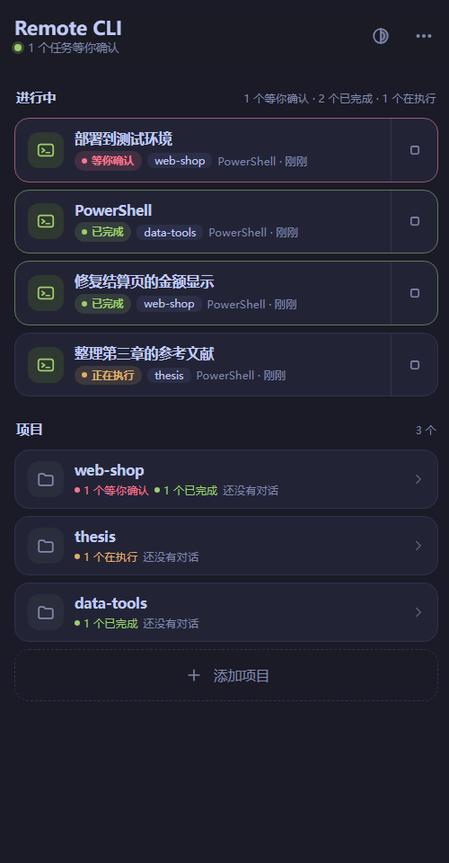

<h1 align="center">Remote CLI</h1>

<p align="center">
  <b>在手机上管理电脑上运行的 Claude Code、Codex 和命令行会话。</b><br>
  查看进度、处理确认请求、继续输入指令。电脑端安装一个程序，手机安装一个 App，扫码完成连接。
</p>

<p align="center">
  <a href="../../releases/latest"></a>
  
  
  <a href="LICENSE"></a>
</p>

<p align="center">
  <a href="#快速开始">快速开始</a> ·
  <a href="#下载">下载</a> ·
  <a href="docs/GUIDE.md">使用说明</a> ·
  <a href="docs/LINUX.md">Linux</a> ·
  <a href="docs/FAQ.md">常见问题</a> ·
  <a href="#安全">安全</a>
</p>

<p align="center"><i>Use your computer's terminal, Claude Code and Codex from your phone. One program on the computer, one app on the phone. The interface is in Chinese for now.</i></p>

<p align="center">
  
  &nbsp;
  
  &nbsp;
  
</p>

## 概述

Claude Code 和 Codex 执行长任务时，会在需要授权时暂停并等待确认，完成一个阶段后也会等待下一条指令。使用者离开电脑期间，任务停在这些节点上。

Remote CLI 将电脑上的终端会话同步到手机，使这些节点可以在手机上处理：

- **远程处理确认请求。** 请求原文和“允许 / 拒绝”显示在任务列表的卡片上，无需进入终端。
- **任务状态通知。** 开启任务提醒后，任务等待确认或执行完成时，手机收到通知。
- **继续会话。** 打开 App 即恢复到会话的当前画面，可继续输入，或切换到其它对话。

Remote CLI 不提供模型服务，也不托管账号。它启动的是电脑上已安装的 `claude`、`codex` 和命令行，使用电脑本地的文件、配置和登录状态。

## 核心能力

<table>
  <tr>
    <td width="50%" valign="top">
      <h3>完整的终端会话</h3>
      手机上显示的是电脑终端的实际画面，支持输入、按键和回看。Claude Code 和 Codex 保存的历史对话可直接继续；电脑上正在使用的对话可先查看内容，再决定是否转到手机。
    </td>
    <td width="50%" valign="top">
      <h3>会话不依赖手机连接</h3>
      终端运行在电脑上。关闭 App、锁屏、切换网络或更换连接方式，任务照常执行；重新打开 App 后恢复到当前画面。
    </td>
  </tr>
  <tr>
    <td width="50%" valign="top">
      <h3>按状态组织任务</h3>
      所有电脑上运行中的任务汇总在一个列表中：等待确认的排在最前，其次是已完成但尚未查看的。各状态以颜色区分，可直接进入或结束终端。
    </td>
    <td width="50%" valign="top">
      <h3>多台电脑统一管理</h3>
      每台电脑扫码一次后由 App 保存。工作台集中显示各台电脑的在线状态和待处理任务数量。
    </td>
  </tr>
  <tr>
    <td width="50%" valign="top">
      <h3>无需服务器和账号</h3>
      同一局域网内直连；外网环境可建立临时公网隧道，或使用公共中转。拥有服务器时可一条命令部署自己的中转，获得固定地址和更低的延迟，并可保存多个中转随时切换。
    </td>
    <td width="50%" valign="top">
      <h3>手机与电脑共用终端</h3>
      同一个终端在手机和电脑上显示同一画面，两端均可输入，无需交接。在电脑端双击该终端即可在电脑上继续使用。
    </td>
  </tr>
  <tr>
    <td width="50%" valign="top">
      <h3>面向触屏的终端界面</h3>
      拖动时画面按像素跟随手指；提供 Esc、Tab、Ctrl+C、方向键等按键行和常用命令面板；手机具备系统语音识别时支持语音输入。六套配色，字号和行距可调。
    </td>
    <td width="50%" valign="top">
      <h3>项目文件查看</h3>
      在手机上浏览项目文件夹，查看代码、Markdown、笔记本、表格、PDF 和图片；Word 和 PowerPoint 带格式显示；文件可保存到手机。
    </td>
  </tr>
</table>

本项目以 MIT 许可开源，不设账号体系，不收集使用数据。电脑端和 App 均支持应用内更新。

### 与其它方案的对比

| | Remote CLI | 手机 SSH 客户端 | 远程桌面 |
| --- | --- | --- | --- |
| 外网访问家中或公司的电脑 | 内置公网隧道和中转，无需公网 IP 和端口映射 | 通常需自行解决公网地址、端口映射或内网穿透 | 常见产品需注册账号，流量经厂商服务器 |
| 锁屏或切换网络后 | 任务不受影响，重新打开后恢复到当前画面 | 连接断开后前台任务随之结束，需另行配置 tmux 等工具 | 会话保留，需重新连接 |
| 掌握任务状态 | 列表按状态排序，可直接处理确认请求，完成后通知 | 需逐个连接查看 | 需持续查看屏幕 |
| 手机端操作 | 面向触屏设计的终端界面和按键行 | 取决于客户端 | 桌面画面按比例缩小，点按和输入效率低 |
| 继续电脑上已有的 Claude Code、Codex 对话 | 列出历史对话，选择后直接继续 | 需自行记录会话并输入恢复命令 | 可以，操作方式同上 |

## 快速开始

在 [Releases](../../releases/latest) 下载 `RemoteCli-Setup-x.y.z.exe`（电脑）和 `RemoteCli-Android.apk`（手机）。

### 1. 电脑：安装并添加项目文件夹

运行安装程序，安装完成后自动打开主窗口。在“项目”页点“添加文件夹”，或将文件夹拖入窗口。手机只能在此处列出的文件夹中启动终端。

<p align="center"></p>

### 2. 电脑：选择连接方式

在“连接”页上方选择。状态变为绿色并显示二维码后，即可连接。

| 使用场景 | 连接方式 | 说明 |
| --- | --- | --- |
| 手机和电脑在同一局域网 | **局域网** | 延迟最低，无需配置。Windows 防火墙首次询问时选择“允许” |
| 外网访问，没有服务器 | **公网隧道** | 点“下载隧道程序”，数秒后获得 https 地址，无需注册账号 |
| 需要固定地址，避免重复扫码 | **中转** | 选择框中列有公共中转时可直接使用；也可在[自己的服务器上部署](docs/SELF_HOSTING.md)，延迟更低 |

连接方式可随时更换，更换不会结束正在运行的终端。

<p align="center"></p>

### 3. 手机：扫码连接

安装并打开 App，点“扫码添加电脑”，扫描电脑端窗口中的二维码。连接后：

1. 进入一个项目，选择“新建 Claude Code”“新建 Codex”或命令行以启动终端；也可从“历史对话”中选择一段继续。
2. 返回工作台，运行中的任务列在“进行中”。等待确认的任务可直接在卡片上选择“允许”或“拒绝”。
3. 如需在离开 App 后接收通知，在工作台底部开启“任务提醒”。

<p align="center">
  
  &nbsp;
  
  &nbsp;
  
  &nbsp;
  
</p>

App 分为三层：**工作台**（所有电脑）、**电脑**（该电脑的项目和任务）、**终端**。各页面的按钮和状态颜色说明见[使用说明](docs/GUIDE.md)，常见问题见[常见问题](docs/FAQ.md)。

### Linux 电脑

```bash
curl -fsSL https://raw.githubusercontent.com/KangWang42/remote-cli/main/agent-linux/install.sh | bash
```

在需要远程使用的 Linux 电脑上执行上述命令，终端显示二维码后用手机 App 扫描。无需域名、账号和 root 权限：公网地址由 Cloudflare 临时隧道提供，程序安装在当前用户目录。需要 Python 3.9 及以上和 systemd。项目文件夹可在连接后通过手机添加。使用自有域名、仅在局域网内使用、卸载和更新等内容见 [Linux 电脑端](docs/LINUX.md)。

## 功能一览

| 功能 | 说明 |
| --- | --- |
| 终端会话 | 显示电脑上 `claude`、`codex` 或 shell 的实际画面，支持输入、按键和回看 |
| 继续已有对话 | 列出 Claude Code 和 Codex 保存的对话，选择后继续；电脑上正在使用的对话可先查看内容，再决定是否转到手机 |
| 手机与电脑共用终端 | 同一终端在两端显示同一画面，均可输入，无需交接 |
| 任务状态 | 等待确认、已完成、正在执行、等待输入分别以不同颜色标示 |
| 列表内处理确认请求 | 程序请求授权时，请求原文和“允许 / 拒绝”显示在列表卡片上 |
| 任务提醒 | 开启后，离开 App 期间有任务等待确认或完成时发送通知；通知栏中没有常驻通知 |
| 工作台 | 运行中的终端与历史终端分开显示，可直接结束终端，按电脑和项目展开或收起；同一段对话只列出一次 |
| 连接方式 | 局域网直连、公网隧道、中转（公共中转或自己的中转，可保存多个）。更换连接方式不会结束终端，手机重新扫码后仍为同一批终端 |
| 连接状态 | 显示当前连接方式、断线重连次数和最近测得的中转延迟 |
| 拖动与滚动 | 画面按像素跟随手指，松手后惯性滑行；Claude Code 和 Codex 的全屏界面同样适用 |
| 文件查看 | 浏览项目文件夹，查看代码、Markdown、笔记本、表格、PDF 和图片，可保存到手机；Word 和 PowerPoint 带格式显示 |
| 外观 | 六套配色（两套明亮、四套深色），字号和行距可调；电脑端窗口使用相同的配色，默认与 App 一致 |
| 应用内更新 | 电脑端和 App 自动检查新版本，下载并校验后安装；也可从手机发起电脑端的更新 |

## 下载

在 [Releases](../../releases/latest) 下载：

| 文件 | 适用设备 |
| --- | --- |
| `RemoteCli-Setup-x.y.z.exe` | Windows 10 / 11（64 位）。安装到当前用户目录，不需要管理员权限 |
| `RemoteCli-Android.apk` | Android 8.0 及以上 |

Linux 电脑无需下载安装包，见 [Linux 电脑](#linux-电脑)。

两个文件均未使用代码签名证书：Windows 会提示“未知发布者”（选择“更多信息 → 仍要运行”），Android 会提示“未知来源”（允许本次安装）。可用发布页的 `SHA256SUMS.txt` 核对文件，也可[从源码构建](docs/DEVELOPMENT.md)。

## 文档

| 文档 | 内容 |
| --- | --- |
| [使用说明](docs/GUIDE.md) | 安装与连接、工作台、项目、终端页、文件查看、更新、停止和卸载 |
| [Linux 电脑端](docs/LINUX.md) | 安装脚本的参数、设置项、与 Windows 电脑端的差异 |
| [常见问题](docs/FAQ.md) | 无法连接、1033 错误、更新失败、电脑上正在使用的对话等 |
| [自己部署中转](docs/SELF_HOSTING.md) | 在服务器上安装中转、配置 https（使用域名或仅有 IP）、电脑端和手机的接入方法、公共中转的运营 |
| [组成、构建和测试](docs/DEVELOPMENT.md) | 目录结构、从源码构建、测试命令 |
| [接口](docs/PROTOCOL.md) | 手机、中转、电脑三方之间的协议，供开发其它客户端或其它系统的电脑端参考 |

## 安全

持有地址和密码即可在电脑上执行命令，应按 SSH 凭据的标准保管。

- 密码由程序随机生成，在电脑上使用 Windows DPAPI 加密保存；中转仅保存登录令牌的哈希。
- 同一来访地址连续输错 6 次密码将被锁定 15 分钟，全部地址的错误次数合计也有上限。
- 局域网直连使用未加密的 http，仅适用于可信网络。外网环境请使用公网隧道或 https 中转。
- 公网隧道的地址随机生成，但知道地址即可访问登录页，其保护仅依赖密码。
- 手机只能在已添加的项目文件夹中启动终端；终端启动后拥有与本机操作相同的权限，可以访问整台电脑。
- 文件查看仅限已添加的项目文件夹内的内容，文件夹中指向外部的链接不会被打开。文件内容经中转传输到手机，中转不保存。
- 中转和电脑端均不将终端的输入输出写入日志；中转在数据目录中保存各终端最近的画面，用于手机重连后恢复显示。

安全问题请通过 GitHub 的私密漏洞报告提交。

## 已知限制

- 带窗口、内置中转和公网隧道的电脑端仅支持 Windows。Linux 电脑端以后台服务形式运行，功能与 Windows 电脑端存在差异，见 [Linux 电脑端](docs/LINUX.md)。暂无 macOS 电脑端。
- 暂无 iOS App。
- 界面仅提供中文。
- 任务提醒需在工作台中手动开启。App 由系统约每分钟唤醒一次进行检查，不使用服务器推送，因此通知比实际状态变化晚数十秒至一分钟，手机深度休眠时延迟更长；部分手机限制后台活动，需在系统设置中允许 App 自启动或后台运行。
- 使用公共中转时，终端的输入和输出经由该中转服务器传输，其运营者在技术上能够查看。处理敏感内容时请使用局域网直连、公网隧道或自己的中转。
- 在电脑上独立打开的命令行窗口，手机只能查看其对话内容，不能接入该窗口；如需在手机上继续，须先结束该窗口。需要两端共用时，请从手机或电脑端“活动”页新建终端。Codex 的“另开一份继续”依赖支持 `fork` 的 Codex CLI（已核对版本 0.161.0）。
- 经公网连接时，按键到回显的延迟主要取决于网络往返（手机 → 中转 → 电脑 → 中转 → 手机），局域网直连延迟最低。
- 最多同时运行 8 个终端。
- 文件查看为只读，不支持在手机上编辑、上传或删除。Word 和 PowerPoint 的预览由手机页面排版：不分页，PowerPoint 的母版样式和图表可能与原文件存在差异。旧格式的 doc、ppt 不支持预览，可保存到手机后用其它应用打开。

## 许可

MIT，见 `LICENSE`。第三方组件见 `THIRD_PARTY.md`。Claude Code 和 Codex 分别是 Anthropic 和 OpenAI 的产品，本项目仅启动电脑上已安装的相应程序。
