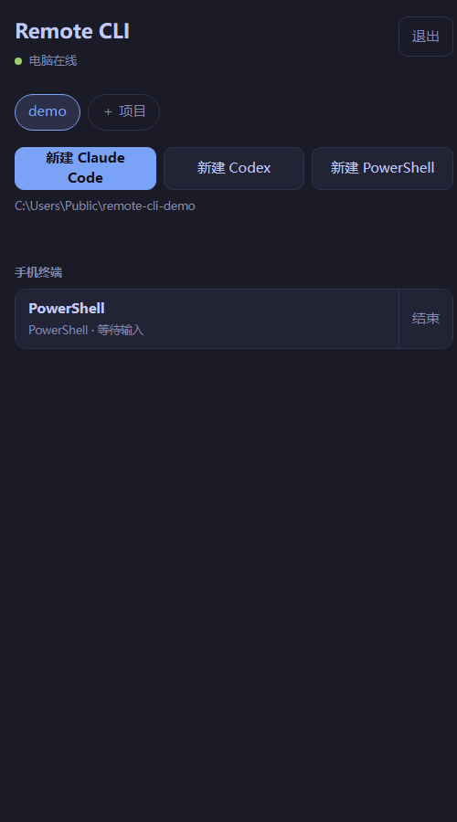

# Remote CLI

在手机上使用电脑里的终端、Claude Code 和 Codex。电脑装一个程序，手机装一个 App，扫码连上。

*Use your computer's terminal, Claude Code and Codex from your phone. One program on the computer, one app on the phone. The interface is in Chinese for now.*

- 真实终端：电脑上用 ConPTY 运行 `claude`、`codex` 或 PowerShell，手机上看到的就是它的画面，可以输入、按键、翻看、语音输入。
- 离开后继续运行：关掉 App，电脑上的任务不停；回来接着看。
- 接着电脑上的对话：列出项目文件夹里 Claude Code 和 Codex 保存的对话，点开就在手机上继续；电脑上正开着的 Claude Code 对话可以接手并关闭电脑上的窗口。
- 六套外观：四套深色、两套明亮，列表和终端一起换；文字大小和终端行距可调。
- 不需要服务器：同一个 Wi-Fi 下直连；或者一键建立 Cloudflare 临时隧道，在外面也能连。有自己服务器的可以部署中转，地址固定。

<p align="center">
  
  &nbsp;
  
  &nbsp;
  
</p>

## 下载

在 [Releases](../../releases/latest) 下载两个文件：

| 文件 | 装在哪 |
| --- | --- |
| `RemoteCli-Setup-x.y.z.exe` | Windows 10 / 11（64 位）电脑。装到当前用户目录，不需要管理员权限，不需要另装 Python |
| `RemoteCli-Android.apk` | 安卓 8.0 及以上的手机 |

两个文件都没有购买代码签名证书：Windows 会提示“未知发布者”（点“更多信息 → 仍要运行”），安卓会提示“未知来源”（允许本次安装）。发布页的 `SHA256SUMS.txt` 可以核对文件；介意的话可以按文末“自己构建”从源码生成。

## 五分钟上手

### 第 1 步：电脑上安装并打开

运行 `RemoteCli-Setup-x.y.z.exe`。安装位置可以改，点“浏览…”选别的盘或文件夹；选了已有内容的文件夹时，程序会装进里面新建的 `RemoteCli` 文件夹。默认位置不需要管理员权限。


装完会自动打开下面这个窗口，桌面和开始菜单里也会有 Remote CLI 的图标。以后想换位置，再运行一次安装程序选新位置即可，设置和密码会保留。


### 第 2 步：添加项目文件夹

在窗口下方的“项目文件夹”点“添加…”，选你平时写代码的文件夹。可以加多个。手机只能在这里列出的文件夹里开终端。

### 第 3 步：选连接方式

| 方式 | 什么时候用 | 要做什么 |
| --- | --- | --- |
| 局域网直连 | 手机和电脑连着同一个 Wi-Fi | 直接选它。第一次会弹出 Windows 防火墙询问，选“允许”。最快 |
| 公网隧道 | 人在外面，手头没有服务器 | 点“下载隧道程序”，确认后程序从 Cloudflare 的 GitHub 发布页下载 `cloudflared`（约 60 MB，只需一次），几秒后得到一个 https 地址。不需要注册账号 |
| 自有中转 | 有自己的服务器，想要固定地址 | 见下面“自己部署中转” |

公网隧道的地址每次启动都会变，重新扫码即可；Cloudflare 不对这种临时隧道的可用性做保证，也需要你的网络能访问 GitHub 和 Cloudflare。

窗口顶部的绿色文字显示“已就绪”，中间出现二维码，就可以用手机连了。

### 第 4 步：手机上安装 App 并扫码

1. 在手机上安装 `RemoteCli-Android.apk` 并打开。
2. 点“扫码连接”，第一次会询问相机权限，允许后对准电脑窗口里的二维码，识别到就自动连上。
3. 不想给相机权限或扫不了时，把电脑窗口里的“地址”和“密码”填到下面的输入框，点“连接”。用手机系统相机扫那个二维码也可以，会跳回 App。

相机画面只在手机上用来找二维码，不保存也不上传。连上一次后 App 会记住这台电脑，90 天内不用再输密码。

### 第 5 步：开一个终端


- 顶部是项目，点一下切换；“＋ 项目”可以把电脑上别的文件夹加进来。
- “新建 Claude Code / Codex / PowerShell”在当前项目文件夹里开一个新终端。按钮只显示电脑上装了的工具。
- “电脑上正在运行”是电脑上正开着的对话，点开可以在手机上接着用；Claude Code 的对话可以选择同时关闭电脑上的窗口，避免两边一起输入。
- “历史对话”是这个文件夹里保存过的对话，点开就继续。
- “手机终端”是从手机开的、还在运行的终端。离开 App 它们不会停。
- 右上角“外观”可以换配色和文字大小，选的配色同时用于终端。

 

### 终端页怎么用


| 位置 | 作用 |
| --- | --- |
| 下面一行按键 | Esc、方向键、回车、Tab、Shift+Tab、PgUp、PgDn、Ctrl+C，左右滑动可以看到全部 |
| 输入框 | 输入后点“发送”；空着点“回车”相当于按一次回车。输入 `/` 会列出 Claude Code 或 Codex 的常用命令 |
| 话筒 | 系统语音识别，识别结果先进输入框，确认后再发送 |
| 手指上下拖动 | 翻看之前的内容 |
| 右上角 Aa | 切换字号（四档） |
| 右上角 ··· | 更换外观（四套深色、两套明亮）、行距（紧凑、适中、宽松）、重命名、复制终端画面、结束终端；画面花屏时可以改用兼容绘制 |
| 左上角 ‹ | 回到列表，终端继续在电脑上运行 |

### 停止和卸载

- 关掉电脑上的窗口只是收到右下角托盘，手机仍然能连。要停止，在托盘图标上点右键选“退出”。
- 取消勾选“允许手机访问”可以立刻挡住手机，不用退出程序。
- 卸载：Windows“设置 → 应用”里找到 Remote CLI，或运行安装目录里的 `Uninstall.exe`。只删除安装程序放进去的文件，同一文件夹里的其他东西不动。

## 常见问题

**手机提示连不上。** 局域网直连时确认手机和电脑在同一个 Wi-Fi，并且防火墙询问时选了“允许”（没选的话到“Windows 安全中心 → 防火墙 → 允许应用通过防火墙”里勾上 python）。公网隧道的地址每次启动都会变，需要重新扫码。

**列表里没有“新建 Claude Code”。** 按钮只显示电脑上能找到的工具。先在电脑的命令行里确认 `claude` 或 `codex` 能运行，再重新打开 Remote CLI。

**输入后要等一下才显示。** 终端优先使用 WebSocket 持续连接，输入和输出实时传输，连续按键不用逐次等待上一条请求完成。公网仍有网络往返延迟；同一个 Wi-Fi 下用局域网直连最快。连接不支持 WebSocket 时会自动切换到 HTTP，Cloudflare 临时隧道会跳过不能及时传输的 SSE。

**端口 8722 被占用。** 退出程序后，把 `%LOCALAPPDATA%\RemoteCli\config.json` 里的 `Port` 改成别的数字再打开。

## 安全

这个工具让拿到地址和密码的人在你的电脑上执行命令，请当作 SSH 密码一样对待。

- 密码由程序随机生成，在电脑上用 Windows 的 DPAPI 加密保存；中转只保存登录令牌的哈希。
- 同一地址连续输错 6 次密码会被锁 15 分钟，所有地址合计也有上限。
- 局域网直连走的是不加密的 http，只在可信的网络里用。在外面请用公网隧道或自己的 https 中转。
- 公网隧道的地址是随机的，但能被知道地址的人访问到登录页，保护它的只有密码。
- 手机只能在你添加的项目文件夹里启动终端，但终端启动后和你坐在电脑前一样，可以访问整台电脑。
- 中转和电脑端都不记录终端的输入输出到日志；中转把最近的终端画面保存在它的数据目录里，供手机重连后恢复显示。

发现安全问题请通过 GitHub 的私密漏洞报告提交。

## 组成

```
手机 App  ──HTTP(S)──▶  中转 relay（电脑上自带，或你自己的服务器）  ◀──HTTP(S)──  电脑端程序（运行终端）
```

| 目录 | 内容 |
| --- | --- |
| `agent-windows/` | 电脑端：`RemoteCliApp.cs`（窗口、托盘、连接方式）、`RemoteCliAgent.cs`（终端与对话扫描）、`QrCode.cs`、`Setup.cs`（安装程序）。C#，用 Windows 自带的编译器构建 |
| `relay/` | 中转：`server.py`（登录与 HTTP）、`relay.py`（终端状态与输出的转发）。只用 Python 标准库 |
| `web/` | App 里显示的页面：列表页和终端页（xterm.js）。由中转提供给 App |
| `android/` | 安卓 App：选择电脑、扫码回调、语音识别，其余是上面的页面 |
| `docs/PROTOCOL.md` | 三方之间的接口，想写别的客户端或别的系统的电脑端看这里 |

电脑和手机都只向中转发起请求，电脑不需要公网地址或端口映射。

## 自己部署中转

需要 Python 3.9 及以上，没有其他依赖。

```bash
git clone https://github.com/KangWang42/remote-cli && cd remote-cli
RCLI_PASSWORD='一个足够长的密码' python3 relay/server.py --host 127.0.0.1 --port 8722 --data /var/lib/remote-cli
```

用 nginx、Caddy 等把一个 https 域名反向代理到 `127.0.0.1:8722`。终端输出走的是保持打开的响应，nginx 需要 `proxy_buffering off;` 和不短于 60 秒的 `proxy_read_timeout`。然后在电脑端选“自有中转”，填这个地址，再点“换一个密码”填入同一个密码。

终端优先使用 WebSocket。nginx 的代理位置还需要 `proxy_http_version 1.1;`、`proxy_set_header Upgrade $http_upgrade;` 和 `proxy_set_header Connection "upgrade";`，让升级请求能够通过；保留上述持续响应设置以支持 HTTP 回退。

不设 `RCLI_PASSWORD` 时，首次启动会生成一个密码，打印出来并保存在数据目录的 `password.txt`。

没有窗口的电脑端 `RemoteCliAgent.exe` 也在安装目录里，适合只用自有中转、想自己用计划任务启动的情况；它读取 `%LOCALAPPDATA%\RemoteCli\config.json`，密码用 `RemoteCliAgent.exe --set-password` 从标准输入写入。

## 自己构建

```powershell
# 电脑端（两个 exe），只需要 Windows 自带的 .NET Framework 4.x
powershell -ExecutionPolicy Bypass -File agent-windows\build.ps1

# 安装程序：会从 python.org 下载官方的嵌入式 Python 并核对哈希
python tools\package_windows.py

# 安卓：需要 JDK 11+ 和 Android SDK（build-tools 36.0.0、platforms/android-36），不需要 Gradle
powershell -ExecutionPolicy Bypass -File android\build.ps1 -Jdk <JDK 目录> -Sdk <SDK 目录>

# 测试
python -m unittest discover -s relay -p "test_*.py"
python tests\e2e_windows.py
node tests\bridge_check.js                                # 传输选择、连续输入和断线重试
python tests\tunnel_check.py --local                       # 直连回显延迟
python tests\tunnel_check.py <cloudflared.exe> --protocol http2  # 公网回显延迟
python tests\setup_check.py dist\RemoteCli-Setup-x.y.z.exe      # 安装程序，沙盒方式，不碰已有安装
java -cp .cache\zxing-core-3.5.3.jar tests\QrDecodeCheck.java <二维码.png> <内容>   # 手机端的二维码识别
```

## 已知限制

- 电脑端目前只有 Windows。macOS 和 Linux 的电脑端还没有写；接口在 `docs/PROTOCOL.md`。
- 没有 iOS App。
- 界面只有中文。
- 接手电脑上正开着的对话并关闭电脑端窗口，只支持 Claude Code；Codex 的对话可以在手机上打开，但电脑上的窗口不会被关。
- 经公网时，按键到回显的延迟主要是网络往返（手机 → 中转 → 电脑 → 中转 → 手机），局域网直连最快。
- 同时最多 8 个终端。

## 许可

MIT，见 `LICENSE`。第三方组件见 `THIRD_PARTY.md`。Claude Code 和 Codex 分别是 Anthropic 和 OpenAI 的产品，本项目只是启动你电脑上已经安装的那一个。
