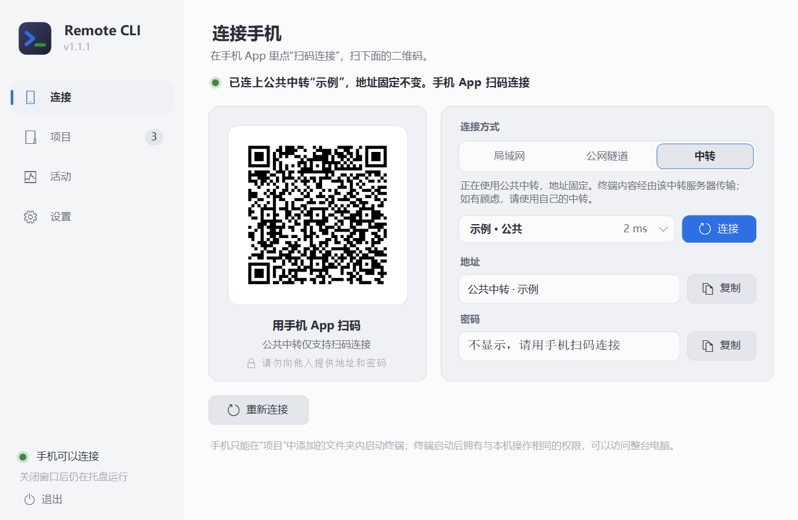
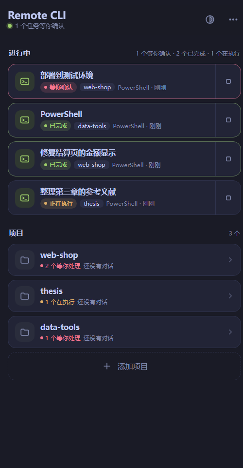
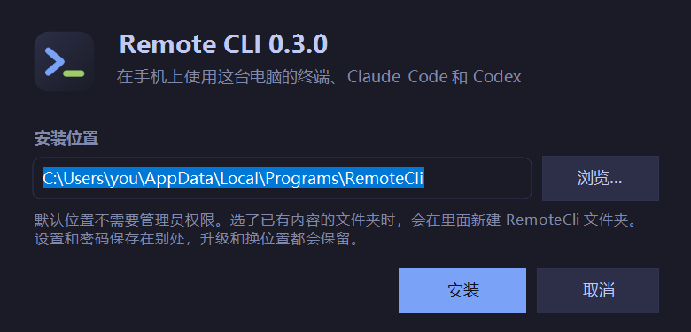
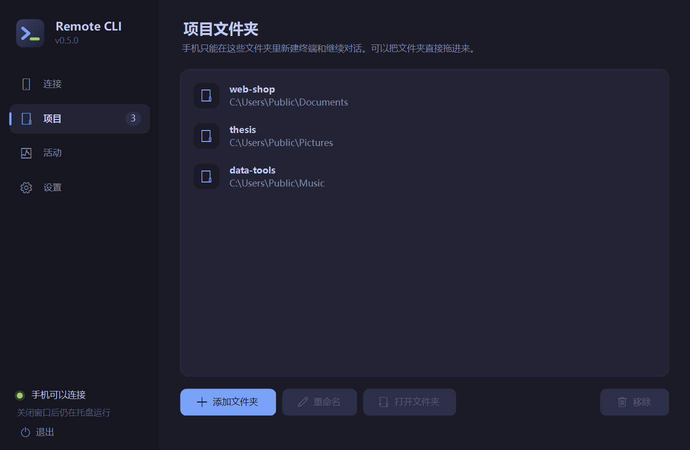
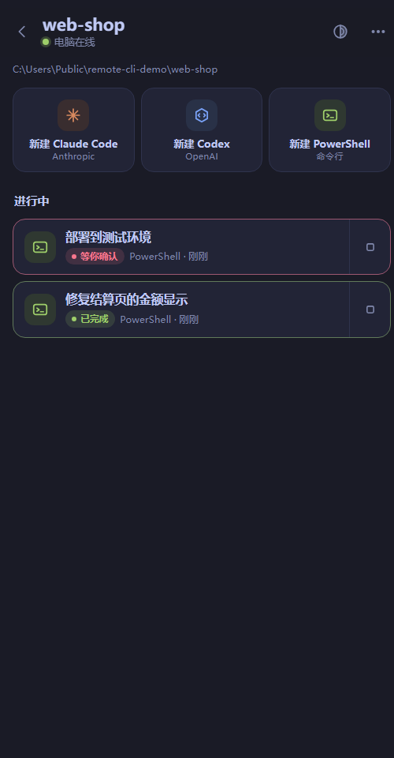
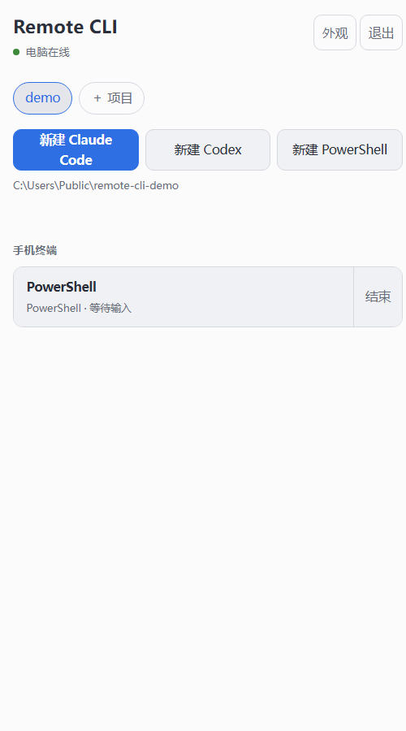
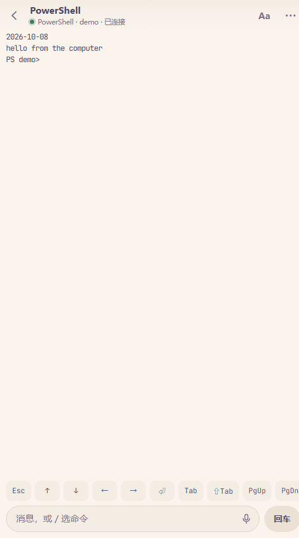
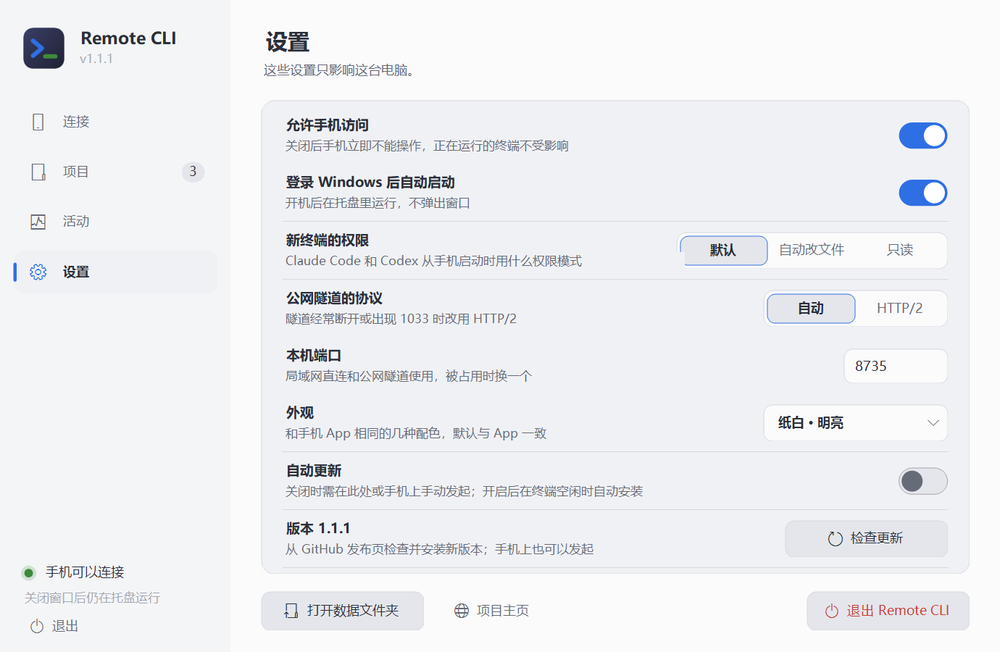

# Remote CLI

在手机上使用电脑里的终端、Claude Code 和 Codex。电脑装一个程序，手机装一个 App，扫码连上。

*Use your computer's terminal, Claude Code and Codex from your phone. One program on the computer, one app on the phone. The interface is in Chinese for now.*

- 真实终端：电脑上用 ConPTY 运行 `claude`、`codex` 或 PowerShell，手机上看到的就是它的画面，可以输入、按键、翻看、语音输入。
- 离开后继续运行：关掉 App，电脑上的任务不停；回来接着看。
- 接着电脑上的对话：列出 Claude Code 和 Codex 保存的对话；Codex 可结束电脑上的独立 CLI 后接手，也可保留电脑会话，在手机新开带历史的副本。
- 六套外观：四套深色、两套明亮，列表和终端一起换；文字大小和终端行距可调。
- 不需要服务器：同一个 Wi-Fi 下直连；或者一键建立 Cloudflare 临时隧道，在外面也能连。有自己服务器的可以部署中转，地址固定。

<p align="center">
  
  &nbsp;
  
  &nbsp;
  
</p>

## 下载

在 [Releases](../../releases/latest) 下载两个文件：

| 文件 | 装在哪 |
| --- | --- |
| `RemoteCli-Setup-x.y.z.exe` | Windows 10 / 11（64 位）电脑。装到当前用户目录，不需要管理员权限，不需要另装 Python |
| `RemoteCli-Android.apk` | 安卓 8.0 及以上的手机 |

电脑端启动、手机端启动或回到前台时会检查 GitHub Releases 的最新正式版本（自动检查最多每 6 小时一次，电脑端也可点“检查更新”立即检查）。发现新版本后会提示：电脑端下载并校验 Windows 安装包，等待当前程序退出后自动替换并重启；手机端校验 APK 后交给 Android 系统安装器。更新只接受本仓库 `KangWang42/remote-cli` 的 HTTPS 发布文件，不会执行任意网页脚本。手机第一次安装可能需要允许“安装未知应用”。 也可以随时手动检查：电脑端在“设置”页最下面一行；手机 App 在首页底部的“版本 x.y.z · 检查更新”，或进入电脑后右上角“···”里的“检查 App 更新”。

两个文件都没有购买代码签名证书：Windows 会提示“未知发布者”（点“更多信息 → 仍要运行”），安卓会提示“未知来源”（允许本次安装）。发布页的 `SHA256SUMS.txt` 可以核对文件；介意的话可以按文末“自己构建”从源码生成。

## 五分钟上手

### 第 1 步：电脑上安装并打开

运行 `RemoteCli-Setup-x.y.z.exe`。安装位置可以改，点“浏览…”选别的盘或文件夹；选了已有内容的文件夹时，程序会装进里面新建的 `RemoteCli` 文件夹。默认位置不需要管理员权限。



装完会自动打开下面这个窗口，桌面和开始菜单里也会有 Remote CLI 的图标。以后想换位置，再运行一次安装程序选新位置即可，设置和密码会保留。


### 第 2 步：添加项目文件夹

第一次打开会停在“项目”页。点“添加文件夹”选你平时写代码的文件夹，或者把文件夹直接拖进窗口；可以加多个，也可以改名、移除。手机只能在这里列出的文件夹里开终端。



### 第 3 步：选连接方式

| 方式 | 什么时候用 | 要做什么 |
| --- | --- | --- |
| 局域网直连 | 手机和电脑连着同一个 Wi-Fi | 直接选它。第一次会弹出 Windows 防火墙询问，选“允许”。最快 |
| 公网隧道 | 人在外面，手头没有服务器 | 点“下载隧道程序”，确认后程序从 Cloudflare 的 GitHub 发布页下载 `cloudflared`（约 60 MB，只需一次），几秒后得到一个 https 地址。不需要注册账号 |
| 自有中转 | 有自己的服务器，想要固定地址 | 见下面“自己部署中转” |

公网隧道的地址每次启动都会变，重新扫码即可；Cloudflare 不对这种临时隧道的可用性做保证，也需要你的网络能访问 GitHub 和 Cloudflare。

在“连接”页上方选方式。状态一行变成绿色、左边出现二维码，就可以用手机连了。公网隧道经常断开或手机上出现 1033 错误时，到“设置”把“公网隧道的协议”改为 HTTP/2。

### 第 4 步：手机上安装 App 并扫码

1. 在手机上安装 `RemoteCli-Android.apk` 并打开。
2. 点“扫码添加电脑”，第一次会询问相机权限，允许后对准电脑窗口里的二维码，识别到就自动连上。
3. 不想给相机权限或扫不了时，点“手动输入地址”，把电脑窗口里的“地址”和“密码”填进去。用手机系统相机扫那个二维码也可以，会跳回 App。

相机画面只在手机上用来找二维码，不保存也不上传。连上一次后 App 会记住这台电脑，90 天内不用再输密码。

**一部手机管几台电脑。** 每台电脑各扫一次码，App 首页“我的电脑”会把它们都列出来，并显示每台现在的情况：几个任务等你确认、几个在执行，或者离线。点一台进去，长按可以改名或移除。只有一台电脑时打开 App 会直接进入它。

连接两台或更多电脑后，首页会出现“聚合查看所有项目和对话”。它按电脑分组列出项目、运行中的终端和保存的会话；点项目会进入对应电脑继续使用，返回键回到电脑列表。

### 第 5 步：跟进所有项目

 

进入一台电脑后，首页最上面的“进行中”把**所有项目**里开着的任务放在一起，最需要你的排在最前；下面是项目，每个项目也标着有几个任务等你处理。每个任务的状态各有一种颜色：

| 状态 | 颜色 | 含义 |
| --- | --- | --- |
| 等你确认 | 红 | 程序停在一个是 / 否的提问上，例如是否允许执行命令 |
| 已完成 | 绿 | 干完了一轮活，你还没有点开看过 |
| 正在执行 | 黄（闪动） | 正在工作 |
| 等待输入 | 灰 | 空着，等你的下一条消息 |
| 正在启动 | 蓝 | 刚开，还没起来 |
| 已结束 / 异常退出 | 灰 / 红字 | 终端已经结束；异常退出是程序带着错误代码退出 |

“等你确认”是根据终端画面上的提问文字判断的，偶尔会判断错；其余状态来自程序自身或最近有没有输出。

点一个项目进去：

- 上面三个大按钮在这个项目文件夹里新建 Claude Code、Codex 或 PowerShell 终端。只显示电脑上装了的工具。
- “电脑 CLI 运行中”是已核实的独立命令行会话，可接手。共享后台、其它远程终端或归属不明的写入锁会折叠在“历史会话仍被后台锁定”里：它们不计入电脑运行中的数量，也不表示电脑有可见窗口；点开 Codex 记录仍可新开带历史的副本。共享锁要接管时，先在原应用中结束并关闭对应会话，再检查接管。
- 电脑端“活动”页与手机使用同一份会话列表。双击手机创建的 Claude Code 或 Codex 终端，确认后会先结束手机终端，再在电脑打开同一个会话；手机端会显示终端已结束。PowerShell 没有可恢复的会话，只能在电脑端重新新建。
- “历史对话”是这个文件夹里保存过的对话，点开就继续；多的时候可以搜索。
- “最近结束”是刚结束的终端，点开能看到它最后的画面。
- 右上角的圆形按钮换配色和文字大小，选的配色同时用于终端；“···”里可以添加项目、换一台电脑。

 

### 终端页怎么用


| 位置 | 作用 |
| --- | --- |
| 下面一行按键 | Esc、方向键、回车、Tab、Shift+Tab、PgUp、PgDn、Ctrl+C，左右滑动可以看到全部 |
| 输入框 | 输入后点“发送”；空着点“回车”相当于按一次回车。输入 `/` 会列出 Claude Code 或 Codex 的常用命令 |
| 话筒 | 系统语音识别，识别结果先进输入框，确认后再发送 |
| 手指上下拖动 | 按屏幕帧翻看之前的内容，松手后短暂惯性滑动；新触摸或反向拖动会停止惯性 |
| 右上角 Aa | 切换字号（四档） |
| 右上角 ··· | 更换外观（四套深色、两套明亮）、行距（紧凑、适中、宽松）、重命名、复制终端画面、结束终端；画面花屏时可以改用兼容绘制 |
| 左上角 ‹ | 回到列表，终端继续在电脑上运行 |
| 点标题 | 切换到别的正在运行的终端，不用先回列表；标题旁的数字是另外还有几个在运行 |
| 标题下出现的一行 | 别的任务完成了或在等你确认，点“切换”直接过去 |

### 停止和卸载

- 关掉电脑上的窗口只是收到右下角托盘，手机仍然能连。要停止，在托盘图标上点右键选“退出”。
- “设置”里关掉“允许手机访问”可以立刻挡住手机，不用退出程序。
- “活动”页能看到手机上开着哪些终端、各自在执行还是在等输入。



- 卸载：Windows“设置 → 应用”里找到 Remote CLI，或运行安装目录里的 `Uninstall.exe`。只删除安装程序放进去的文件，同一文件夹里的其他东西不动。

## 常见问题

**手机提示连不上。** 局域网直连时确认手机和电脑在同一个 Wi-Fi，并且防火墙询问时选了“允许”（没选的话到“Windows 安全中心 → 防火墙 → 允许应用通过防火墙”里勾上 python）。公网隧道的地址每次启动都会变，需要重新扫码。

**电脑关闭后手机停在 1033 错误页。** 0.5.2 起，APP 遇到隧道错误会自动返回连接页，显示“重新扫码连接电脑”。正在查看终端时也会独立检查连接；短暂的网络波动先重试，连续两次检查失败才返回。请重新打开电脑端，再扫描新的二维码。此功能需要更新手机 APK。

**手机更新提示 “file still open”。** 这是旧版更新器在提交 APK 前还占用安装流导致的。请先安装 0.5.4；新版会在提交系统安装前关闭安装流，并在失败时清理安装会话。

**列表里没有“新建 Claude Code”。** 按钮只显示电脑上能找到的工具。先在电脑的命令行里确认 `claude` 或 `codex` 能运行，再重新打开 Remote CLI。

**输入后要等一下才显示。** 终端优先使用 WebSocket 持续连接，输入和输出实时传输，连续按键不用逐次等待上一条请求完成。公网仍有网络往返延迟；同一个 Wi-Fi 下用局域网直连最快。连接不支持 WebSocket 时会自动切换到 HTTP，Cloudflare 临时隧道会跳过不能及时传输的 SSE。

**Codex 为什么有时只能新开副本？** 电脑端核实对话的写入锁和实际进程归属后，才提供“接手，并结束电脑上的 CLI 会话”。桌面应用或编辑器的共享后台可能同时管理多个对话，这时显示具体原因，并提供“在手机新开副本，保留电脑会话”。副本通过 `codex fork` 保留此前历史，之后各自继续；已结束的对话用 `codex resume` 恢复。结束 CLI 后，外层 PowerShell 窗口可能仍保留。新版手机页面需要新版电脑后台，旧后台会提示更新。

**电脑只显示一段对话，手机为什么列出其它标题？** Codex 桌面应用或编辑器可能保留旧对话的写入锁，另一套远程终端也可能在隐藏后台运行。新版把它们折叠在“历史会话仍被后台锁定”，并标明“后台锁定 · 没有可见窗口”“其它远程终端锁定”或“归属待确认”，不会计入电脑活动，也不结束这些进程。Codex 记录仍可新开副本；要接管原对话，先在原应用中结束并关闭它。

**电脑端活动页可以接管手机终端吗？** 0.5.3 起双击手机创建的 Claude Code 或 Codex 终端，确认后会结束手机终端并在电脑打开同一会话。接管前会重新核对进程和会话编号；核对失败会保留手机终端并提示原因。PowerShell 进程没有可恢复会话，只能重新新建。

**启动后马上结束。** 终端画面和退出代码会保留；检查画面中的 CLI 提示，例如登录状态、命令支持或工作目录。会话扫描遵循 `CODEX_HOME`，旧锁文件不会仅因存在而被显示为运行中。

**端口 8722 被占用。** 退出程序后，把 `%LOCALAPPDATA%\RemoteCli\config.json` 里的 `Port` 改成别的数字再打开。

## 安全

这个工具让拿到地址和密码的人在你的电脑上执行命令，请当作 SSH 密码一样对待。

- 密码由程序随机生成，在电脑上用 Windows 的 DPAPI 加密保存；中转只保存登录令牌的哈希。
- 同一地址连续输错 6 次密码会被锁 15 分钟，所有地址合计也有上限。
- 局域网直连走的是不加密的 http，只在可信的网络里用。在外面请用公网隧道或自己的 https 中转。
- 公网隧道的地址是随机的，但能被知道地址的人访问到登录页，保护它的只有密码。
- 手机只能在你添加的项目文件夹里启动终端，但终端启动后和你坐在电脑前一样，可以访问整台电脑。
- 中转和电脑端都不记录终端的输入输出到日志；中转把最近的终端画面保存在它的数据目录里，供手机重连后恢复显示。

发现安全问题请通过 GitHub 的私密漏洞报告提交。

## 组成

```
手机 App  ──HTTP(S)──▶  中转 relay（电脑上自带，或你自己的服务器）  ◀──HTTP(S)──  电脑端程序（运行终端）
```

| 目录 | 内容 |
| --- | --- |
| `agent-windows/` | 电脑端：`RemoteCliApp.cs`（窗口、托盘、连接方式）、`RemoteCliAgent.cs`（终端与对话扫描）、`QrCode.cs`、`Setup.cs`（安装程序）。C#，用 Windows 自带的编译器构建 |
| `relay/` | 中转：`server.py`（登录与 HTTP）、`relay.py`（终端状态与输出的转发）。只用 Python 标准库 |
| `web/` | App 里显示的页面：列表页和终端页（xterm.js）。由中转提供给 App |
| `android/` | 安卓 App：选择电脑、扫码回调、语音识别，其余是上面的页面 |
| `docs/PROTOCOL.md` | 三方之间的接口，想写别的客户端或别的系统的电脑端看这里 |

电脑和手机都只向中转发起请求，电脑不需要公网地址或端口映射。

## 自己部署中转

需要 Python 3.9 及以上，没有其他依赖。

```bash
git clone https://github.com/KangWang42/remote-cli && cd remote-cli
RCLI_PASSWORD='一个足够长的密码' python3 relay/server.py --host 127.0.0.1 --port 8722 --data /var/lib/remote-cli
```

用 nginx、Caddy 等把一个 https 域名反向代理到 `127.0.0.1:8722`。终端输出走的是保持打开的响应，nginx 需要 `proxy_buffering off;` 和不短于 60 秒的 `proxy_read_timeout`。然后在电脑端选“自有中转”，填这个地址，再点“换一个密码”填入同一个密码。

终端优先使用 WebSocket。nginx 的代理位置还需要 `proxy_http_version 1.1;`、`proxy_set_header Upgrade $http_upgrade;` 和 `proxy_set_header Connection "upgrade";`，让升级请求能够通过；保留上述持续响应设置以支持 HTTP 回退。

不设 `RCLI_PASSWORD` 时，首次启动会生成一个密码，打印出来并保存在数据目录的 `password.txt`。

没有窗口的电脑端 `RemoteCliAgent.exe` 也在安装目录里，适合只用自有中转、想自己用计划任务启动的情况；它读取 `%LOCALAPPDATA%\RemoteCli\config.json`，密码用 `RemoteCliAgent.exe --set-password` 从标准输入写入。

## 自己构建

```powershell
# 电脑端（两个 exe），只需要 Windows 自带的 .NET Framework 4.x
powershell -ExecutionPolicy Bypass -File agent-windows\build.ps1

# 安装程序：会从 python.org 下载官方的嵌入式 Python 并核对哈希
python tools\package_windows.py

# 安卓：需要 JDK 11+ 和 Android SDK（build-tools 36.0.0、platforms/android-36），不需要 Gradle
powershell -ExecutionPolicy Bypass -File android\build.ps1 -Jdk <JDK 目录> -Sdk <SDK 目录>

# 测试
python -m unittest discover -s relay -p "test_*.py"
python tests\e2e_windows.py
node tests\bridge_check.js                                # 传输选择、连续输入和断线重试
node tests\terminal_scroll_check.js                       # 拖动、惯性、反向和停止
python tests\native_owner_check.py                       # 临时进程验证归属，不操作真实 Codex 会话
python tests\tunnel_check.py --local                       # 直连回显延迟
python tests\tunnel_check.py <cloudflared.exe> --protocol http2  # 公网回显延迟
python tests\setup_check.py dist\RemoteCli-Setup-x.y.z.exe      # 安装程序，沙盒方式，不碰已有安装
java -cp .cache\zxing-core-3.5.3.jar tests\QrDecodeCheck.java <二维码.png> <内容>   # 手机端的二维码识别
```

## 已知限制

- 电脑端目前只有 Windows。macOS 和 Linux 的电脑端还没有写；接口在 `docs/PROTOCOL.md`。
- 没有 iOS App。
- 界面只有中文。
- Codex 接手仅用于能确认归属的独立 CLI；共享后台使用副本入口。它依赖支持 `fork` 的 Codex CLI（本次核对版本 0.161.0），不把两个独立终端当作同一画面的实时镜像。
- 经公网时，按键到回显的延迟主要是网络往返（手机 → 中转 → 电脑 → 中转 → 手机），局域网直连最快。
- 同时最多 8 个终端。

## 许可

MIT，见 `LICENSE`。第三方组件见 `THIRD_PARTY.md`。Claude Code 和 Codex 分别是 Anthropic 和 OpenAI 的产品，本项目只是启动你电脑上已经安装的那一个。
